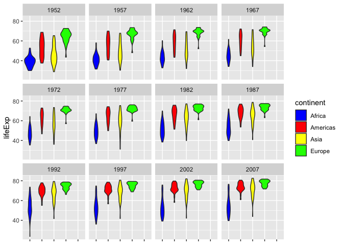

HW 03 - figalit
================

Always begin by loading necessary packages:

``` r
suppressPackageStartupMessages(library(tidyverse))
suppressPackageStartupMessages(library(gapminder))
library(ggplot2)
```

Populating cheat sheet!
-----------------------

**First question**

Getting the maximum and minimum of GDP per capita for all continents:

``` r
# One way is to present them stacked on top of each other.
minimums <- aggregate(gdpPercap ~ continent, gapminder, min)
maximums <- aggregate(gdpPercap ~ continent, gapminder, max)
combinedMinMaxData <- rbind(minimums, maximums)
knitr::kable(combinedMinMaxData)
```

| continent |    gdpPercap|
|:----------|------------:|
| Africa    |     241.1659|
| Americas  |    1201.6372|
| Asia      |     331.0000|
| Europe    |     973.5332|
| Oceania   |   10039.5956|
| Africa    |   21951.2118|
| Americas  |   42951.6531|
| Asia      |  113523.1329|
| Europe    |   49357.1902|
| Oceania   |   34435.3674|

``` r
# Or in a different way, "side by side":
minMaxData <- gapminder %>%
  group_by(continent) %>%
  summarize(minim = min(gdpPercap),
            maxim = max(gdpPercap))
knitr::kable(minMaxData)
```

| continent |       minim|      maxim|
|:----------|-----------:|----------:|
| Africa    |    241.1659|   21951.21|
| Americas  |   1201.6372|   42951.65|
| Asia      |    331.0000|  113523.13|
| Europe    |    973.5332|   49357.19|
| Oceania   |  10039.5956|   34435.37|

``` r
# Let's plot out these points, just to see.
ggplot(combinedMinMaxData, aes(x = continent, y = gdpPercap)) +
  geom_point()
```


``` r
# And now all data in a boxplot
ggplot(gapminder, aes(x = continent, y = gdpPercap)) +
  geom_boxplot(outlier.colour = "blue") +
  geom_jitter(position = position_jitter(width = 0.1, height = 0), alpha = 1/4)
```


**Second question**

Looking at the spread of GDP per capita within the continents.

To understand spread, we need to look at different measures, like standard deviation or variance, median or quantiles. I have plotted some different ways of understanding this spread.

``` r
# Some statistics: 
data <- gapminder %>% 
  group_by(continent) %>%
  summarize(mean = mean(gdpPercap), 
            median = median(gdpPercap), 
            std = sd(gdpPercap), 
            interquantileRange = IQR(gdpPercap)) %>%
  arrange(std) # optional
knitr::kable(data)
```

| continent |       mean|     median|        std|  interquantileRange|
|:----------|----------:|----------:|----------:|-------------------:|
| Africa    |   2193.755|   1192.138|   2827.930|            1616.170|
| Oceania   |  18621.609|  17983.304|   6358.983|            8072.258|
| Americas  |   7136.110|   5465.510|   6396.764|            4402.431|
| Europe    |  14469.476|  12081.749|   9355.213|           13248.301|
| Asia      |   7902.150|   2646.787|  14045.373|            7492.262|

``` r
# -- Some plots --
# One way is to look at a nice histogram to understand the general trend for each continent
ggplot(gapminder, aes(gdpPercap)) + 
  geom_histogram(aes(fill=continent), bins=15)
```


``` r
# And we could have many histograms, one per each continent
ggplot(gapminder, aes(gdpPercap)) + 
  geom_histogram(bins=15) + 
  facet_wrap( ~ continent)
```


``` r
# We could also have several plots, one per each year, 
# but Oceania does not have enough points for a violin plot.
ggplot(gapminder, aes(x=continent, y=gdpPercap, fill=continent)) +
  geom_violin() +
  scale_y_log10() +
  facet_wrap(~ year) +
  scale_fill_manual(values = c("blue", "red", "yellow", "green")) + 
  theme(axis.text.x = element_blank(), 
        axis.title.x = element_blank()) # to remove the continent names from the x axis.
```


**Third question**

Computing a trimmed mean of life expectancy for different years. Notice arranging by mean implicitly arranges by year, showing the increase of lifeExp as years go by, in a global scale.

``` r
trimmedMean <- gapminder %>%
  group_by(year) %>%
  summarize(tm = mean(lifeExp, trim=0.2)) %>%
  arrange(tm)
knitr::kable(trimmedMean)
```

|  year|        tm|
|-----:|---------:|
|  1952|  47.74866|
|  1957|  50.64422|
|  1962|  53.12857|
|  1967|  55.63999|
|  1972|  58.12370|
|  1977|  60.38896|
|  1982|  62.47444|
|  1987|  64.48383|
|  1992|  65.89072|
|  1997|  66.84437|
|  2002|  67.77385|
|  2007|  69.17224|

``` r
ggplot(trimmedMean, aes(x=year, y=tm)) +
  geom_point() +
  geom_line()
```


How is life expectancy changing over time on different continents?

``` r
data <- gapminder %>% 
  group_by(continent) %>%
  summarize(avgLifeExp = mean(lifeExp)) %>%
  arrange(avgLifeExp) # optional
knitr::kable(data)
```

| continent |  avgLifeExp|
|:----------|-----------:|
| Africa    |    48.86533|
| Asia      |    60.06490|
| Americas  |    64.65874|
| Europe    |    71.90369|
| Oceania   |    74.32621|

``` r
# And now also grouping by year
avgLifeExpPerYear <- gapminder %>% 
  group_by(continent, year) %>%
  summarize(avgLifeExp = mean(lifeExp)) %>%
  arrange(year) # optional
knitr::kable(avgLifeExpPerYear)
```

| continent |  year|  avgLifeExp|
|:----------|-----:|-----------:|
| Africa    |  1952|    39.13550|
| Americas  |  1952|    53.27984|
| Asia      |  1952|    46.31439|
| Europe    |  1952|    64.40850|
| Oceania   |  1952|    69.25500|
| Africa    |  1957|    41.26635|
| Americas  |  1957|    55.96028|
| Asia      |  1957|    49.31854|
| Europe    |  1957|    66.70307|
| Oceania   |  1957|    70.29500|
| Africa    |  1962|    43.31944|
| Americas  |  1962|    58.39876|
| Asia      |  1962|    51.56322|
| Europe    |  1962|    68.53923|
| Oceania   |  1962|    71.08500|
| Africa    |  1967|    45.33454|
| Americas  |  1967|    60.41092|
| Asia      |  1967|    54.66364|
| Europe    |  1967|    69.73760|
| Oceania   |  1967|    71.31000|
| Africa    |  1972|    47.45094|
| Americas  |  1972|    62.39492|
| Asia      |  1972|    57.31927|
| Europe    |  1972|    70.77503|
| Oceania   |  1972|    71.91000|
| Africa    |  1977|    49.58042|
| Americas  |  1977|    64.39156|
| Asia      |  1977|    59.61056|
| Europe    |  1977|    71.93777|
| Oceania   |  1977|    72.85500|
| Africa    |  1982|    51.59287|
| Americas  |  1982|    66.22884|
| Asia      |  1982|    62.61794|
| Europe    |  1982|    72.80640|
| Oceania   |  1982|    74.29000|
| Africa    |  1987|    53.34479|
| Americas  |  1987|    68.09072|
| Asia      |  1987|    64.85118|
| Europe    |  1987|    73.64217|
| Oceania   |  1987|    75.32000|
| Africa    |  1992|    53.62958|
| Americas  |  1992|    69.56836|
| Asia      |  1992|    66.53721|
| Europe    |  1992|    74.44010|
| Oceania   |  1992|    76.94500|
| Africa    |  1997|    53.59827|
| Americas  |  1997|    71.15048|
| Asia      |  1997|    68.02052|
| Europe    |  1997|    75.50517|
| Oceania   |  1997|    78.19000|
| Africa    |  2002|    53.32523|
| Americas  |  2002|    72.42204|
| Asia      |  2002|    69.23388|
| Europe    |  2002|    76.70060|
| Oceania   |  2002|    79.74000|
| Africa    |  2007|    54.80604|
| Americas  |  2007|    73.60812|
| Asia      |  2007|    70.72848|
| Europe    |  2007|    77.64860|
| Oceania   |  2007|    80.71950|

``` r
# Plotting these out directly
ggplot(avgLifeExpPerYear,
       aes(x=year, y=avgLifeExp)) +
  geom_point() +
  geom_smooth() +
  facet_wrap(~ continent)
```

    ## `geom_smooth()` using method = 'loess' and formula 'y ~ x'


``` r
# Similar to above, we can plot a violin plot to understand the trends.
ggplot(gapminder, aes(x=continent, y=lifeExp, fill=continent)) +
  geom_violin() +
  facet_wrap(~ year) +
  scale_fill_manual(values = c("blue", "red", "yellow", "green")) + 
  theme(axis.text.x = element_blank(), 
        axis.title.x = element_blank()) # to remove the continent names from the x axis.
```



*End of solution*

### Future work

Since this is a cheatsheet, I am adding the template for solving the remaining tasks(so I can complete them later). Ignore all this!

-   Report the absolute and/or relative abundance of countries with low life expectancy over time by continent: Compute some measure of worldwide life expectancy ??? you decide ??? a mean or median or some other quantile or perhaps your current age. Then determine how many countries on each continent have a life expectancy less than this benchmark, for each year.

-   Find countries with interesting stories. Open-ended and, therefore, hard. Promising but unsuccessful attempts are encouraged. This will generate interesting questions to follow up on in class.
